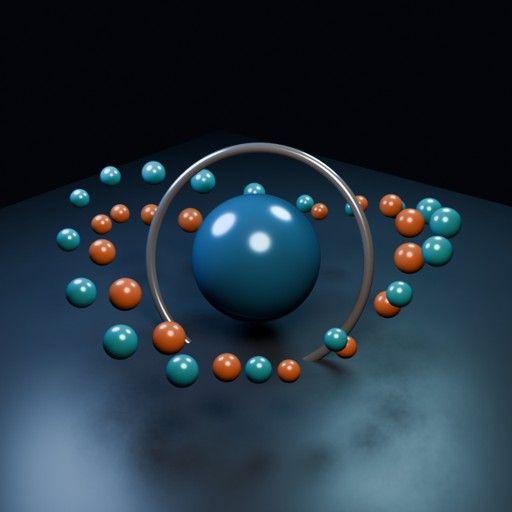

# Latest Blender Render

- source commit: `b296ceda1274ee2e407b4c3ded1a36efeae17396`
- Actions run: `3` (`36209563314`)



## Validation

```json
{
  "path": "output/render.png",
  "size_bytes": 493025,
  "width": 640,
  "height": 640,
  "luminance_min": 0,
  "luminance_max": 249,
  "luminance_mean": 47.771,
  "luminance_stddev": 42.641,
  "unique_colors_64x64": 2272,
  "sha256": "a7956d1f7a2eeba959bf39c636494ae5612f9e72e66fae7898c0c26da41a20ab"
}
```
