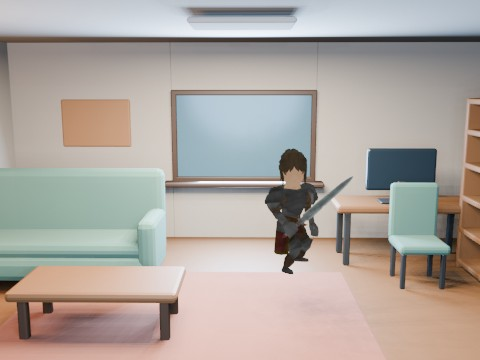

# Character Room Interior EEVEE

A reusable 7.2m x 5.4m x 3.0m open-front living/study room built from Blender primitives, furnished and lit at room scale, with the Quaternius Warrior idling as a human-scale reference during a 15-second camera tour.

- source commit: `c849e43fca049e20f43ed5098492e1492296e502`
- Actions run: `53` (`36322787601`)
- full artifact: `blender-character-room-interior-eevee`

## Blend files

- Git: [character-room-interior-eevee.blend](./character-room-interior-eevee.blend) (14,131,428 bytes)



## Validation

```json
{
  "video": "character-room-interior-eevee.mp4",
  "preview": {
    "size_bytes": 214935,
    "luminance_min": 11,
    "luminance_max": 251,
    "luminance_stddev": 41.328,
    "sha256": "1b2eb27608fdf71b697dc9ecaab928f830e08d82a0f702ae37d1fc8450e0af6a"
  },
  "movie": {
    "size_bytes": 149158,
    "duration_seconds": 15.0,
    "avg_frame_rate": "24/1",
    "nb_frames": "360",
    "sha256": "0d3ee6d9b1cf2825b97c40e534fa3cf43ea151d92066858140740a070ce30d28"
  },
  "report": {
    "room_dimensions_m": [
      7.2,
      5.4,
      3.0
    ],
    "room_mesh_count": 8,
    "furniture_object_count": 37,
    "decor_object_count": 12,
    "furniture_groups": [
      "rug",
      "sofa",
      "coffee_table",
      "desk",
      "chair",
      "bookshelf",
      "floor_lamp"
    ],
    "light_count": 4,
    "camera_keyframes": 4,
    "total_scene_mesh_count": 63,
    "character_height_m": 1.80086,
    "character_action_count": 13,
    "selected_action": "Idle_Attacking_CharacterArmature",
    "blend_size_bytes": 14131428
  }
}
```

## License / ライセンス

Unless otherwise noted, generated assets in this result (including rendered images, video, and generated .blend files) are CC0-1.0. Source code and workflow files used to generate them are MIT-0.

特記のない限り、この成果物内の生成アセット（レンダリング画像、動画、生成された .blend ファイル等）は CC0-1.0、生成に使用したソースコードや workflow は MIT-0 です。

Third-party data, assets, or source material remain subject to their original licenses and terms. These repository licenses apply only to rights we are entitled to grant.

第三者のデータ・アセット・素材・ソースを利用している部分は、利用元のライセンスおよび利用条件に従います。このリポジトリのライセンスは、こちらが許諾できる権利にのみ適用されます。

See ../../LICENSE and ../../LICENSES/ for details.
