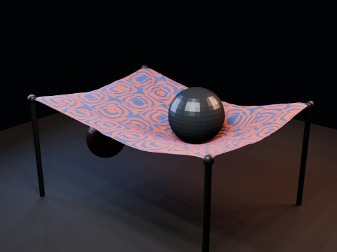

# Cloth Hammock Collision EEVEE

A CPU-heavy cloth simulation test: a four-corner-pinned hammock cloth with self collision, wind/turbulence and two animated sphere colliders. Physics is baked into shape keys before parallel EEVEE rendering.

- source commit: `e2f23a87a9502b9a0268bfb7bc1493ee773590dd`
- Actions run: `32` (`36235853079`)
- full artifact: `blender-cloth-hammock-collision-eevee`

## Blend files

- Git: [cloth-hammock-collision-eevee.blend](./cloth-hammock-collision-eevee.blend) (3,235,296 bytes)



## Validation

```json
{
  "preview": {
    "path": "output/preview.png",
    "size_bytes": 223377,
    "width": 480,
    "height": 360,
    "luminance_min": 0,
    "luminance_max": 193,
    "luminance_mean": 40.524,
    "luminance_stddev": 49.502,
    "sha256": "97b85258c0f237c55be6dcb252725e5578ff06d9da2406dc2d740ebfd754fbbe"
  },
  "movie": {
    "path": "output/cloth-hammock-collision-eevee.mp4",
    "size_bytes": 53284,
    "width": 480,
    "height": 360,
    "duration_seconds": 4.0,
    "avg_frame_rate": "24/1",
    "nb_frames": "96",
    "sha256": "0e639316db028597951cf6b6099d90c5585b6092edb245fe92c96677e819625b"
  },
  "report": {
    "engine": "BLENDER_EEVEE",
    "vertex_count": 1575,
    "face_count": 1496,
    "pinned_vertex_count": 36,
    "baked_shape_keys": 96,
    "shape_key_count": 97,
    "simulation_seconds": 6.39,
    "colliders": [
      "BallAbove",
      "BallBelow"
    ],
    "effectors": [
      "CrossWind",
      "Turbulence"
    ],
    "blend_size_bytes": 3235296
  }
}
```

## License / ライセンス

Unless otherwise noted, generated assets in this result (including rendered images, video, and generated .blend files) are CC0-1.0. Source code and workflow files used to generate them are MIT-0.

特記のない限り、この成果物内の生成アセット（レンダリング画像、動画、生成された .blend ファイル等）は CC0-1.0、生成に使用したソースコードや workflow は MIT-0 です。

Third-party data, assets, or source material remain subject to their original licenses and terms. These repository licenses apply only to rights we are entitled to grant.

第三者のデータ・アセット・素材・ソースを利用している部分は、利用元のライセンスおよび利用条件に従います。このリポジトリのライセンスは、こちらが許諾できる権利にのみ適用されます。

See ../../LICENSE and ../../LICENSES/ for details.
