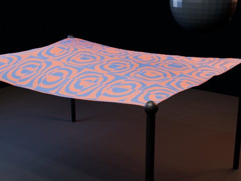

# Cloth Hammock Collision Movie EEVEE

An 8-second presentation-oriented extension of the cloth hammock experiment with two-stage sphere impacts, moving wind/turbulence, and a slow animated camera. Cloth physics is baked to shape keys before parallel EEVEE rendering.

- source commit: `632813ff48f45f92111f330386e2f10f72d4b454`
- Actions run: `34` (`36236915724`)
- full artifact: `blender-cloth-hammock-collision-movie-eevee`

## Blend files

- Git: [cloth-hammock-collision-movie-eevee.blend](./cloth-hammock-collision-movie-eevee.blend) (5,123,800 bytes)



## Validation

```json
{
  "video": "cloth-hammock-collision-movie-eevee.mp4",
  "preview": {
    "path": "output/preview.png",
    "size_bytes": 222671,
    "width": 480,
    "height": 360,
    "luminance_min": 0,
    "luminance_max": 190,
    "luminance_mean": 58.456,
    "luminance_stddev": 62.325,
    "sha256": "b3e7cd154137f09ca790f3ec3ba0e4e17bf5a6724b453c7184ebb167efb73151"
  },
  "movie": {
    "path": "output/cloth-hammock-collision-movie-eevee.mp4",
    "size_bytes": 176460,
    "width": 480,
    "height": 360,
    "duration_seconds": 8.0,
    "avg_frame_rate": "24/1",
    "nb_frames": "192",
    "sha256": "9332817df9a873376d261e681595483ef41bfd1a465440fcfbf458fa3a68613f"
  },
  "report": {
    "engine": "BLENDER_EEVEE",
    "vertex_count": 1575,
    "face_count": 1496,
    "pinned_vertex_count": 36,
    "baked_shape_keys": 192,
    "shape_key_count": 193,
    "simulation_seconds": 14.582,
    "colliders": [
      "BallAbove",
      "BallBelow"
    ],
    "effectors": [
      "CrossWind",
      "Turbulence"
    ],
    "blend_size_bytes": 5123800
  }
}
```

## License / ライセンス

Unless otherwise noted, generated assets in this result (including rendered images, video, and generated .blend files) are CC0-1.0. Source code and workflow files used to generate them are MIT-0.

特記のない限り、この成果物内の生成アセット（レンダリング画像、動画、生成された .blend ファイル等）は CC0-1.0、生成に使用したソースコードや workflow は MIT-0 です。

Third-party data, assets, or source material remain subject to their original licenses and terms. These repository licenses apply only to rights we are entitled to grant.

第三者のデータ・アセット・素材・ソースを利用している部分は、利用元のライセンスおよび利用条件に従います。このリポジトリのライセンスは、こちらが許諾できる権利にのみ適用されます。

See ../../LICENSE and ../../LICENSES/ for details.
