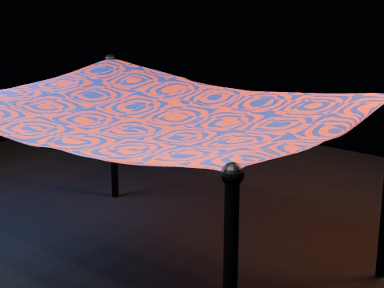

# Cloth Hammock Rigid Body Drop EEVEE

Hybrid cloth + rigid-body experiment: 12 staggered rigid-body spheres fall into a four-corner-pinned cloth hammock. A hidden passive rigid proxy provides stable two-system coupling while the visible cloth reacts to the moving spheres. Physics is baked before parallel EEVEE rendering.

- source commit: `eb529cae9431fe5d0ee5092a240912c88d9ad2de`
- Actions run: `37` (`36239159364`)
- full artifact: `blender-cloth-hammock-rigidbody-drop-eevee`

## Blend files

- Git: [cloth-hammock-rigidbody-drop-eevee.blend](./cloth-hammock-rigidbody-drop-eevee.blend) (7,609,332 bytes)



## Validation

```json
{
  "video": "cloth-hammock-rigidbody-drop-eevee.mp4",
  "preview": {
    "path": "output/preview.png",
    "size_bytes": 223573,
    "width": 480,
    "height": 360,
    "luminance_min": 0,
    "luminance_max": 191,
    "luminance_mean": 60.049,
    "luminance_stddev": 64.742,
    "sha256": "abe3111ad04e88bf4aaf2bfb796005b6bf66bab9224eb14d3e676dfb6fceb5f4"
  },
  "movie": {
    "path": "output/cloth-hammock-rigidbody-drop-eevee.mp4",
    "size_bytes": 150052,
    "width": 480,
    "height": 360,
    "duration_seconds": 8.0,
    "avg_frame_rate": "24/1",
    "nb_frames": "192",
    "sha256": "b5070ad80525123ba0171d1d9b9d5bd3ed832c2e0568a69329a57da31668518d"
  },
  "report": {
    "engine": "BLENDER_EEVEE",
    "vertex_count": 1575,
    "face_count": 1496,
    "pinned_vertex_count": 36,
    "baked_shape_keys": 192,
    "shape_key_count": 193,
    "simulation_seconds": 14.978,
    "rigid_body_count": 12,
    "rigid_body_bake_seconds": 0.13,
    "rigid_body_proxy": "RigidHammockProxy",
    "effectors": [
      "CrossWind",
      "Turbulence"
    ],
    "blend_size_bytes": 7609332
  }
}
```

## License / ライセンス

Unless otherwise noted, generated assets in this result (including rendered images, video, and generated .blend files) are CC0-1.0. Source code and workflow files used to generate them are MIT-0.

特記のない限り、この成果物内の生成アセット（レンダリング画像、動画、生成された .blend ファイル等）は CC0-1.0、生成に使用したソースコードや workflow は MIT-0 です。

Third-party data, assets, or source material remain subject to their original licenses and terms. These repository licenses apply only to rights we are entitled to grant.

第三者のデータ・アセット・素材・ソースを利用している部分は、利用元のライセンスおよび利用条件に従います。このリポジトリのライセンスは、こちらが許諾できる権利にのみ適用されます。

See ../../LICENSE and ../../LICENSES/ for details.
