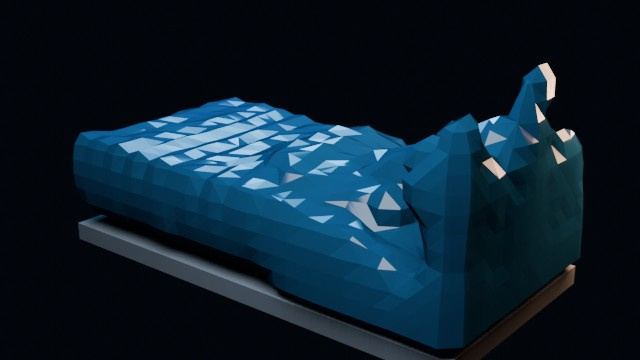

# Fluid Dam Break

A low-resolution Mantaflow liquid dam-break simulation with a center obstacle and a low barrier.

- source commit: `9f290e0f9aa71f129ab0ce5d1a5e7cbba9a9265d`
- Actions run: `15` (`36215444736`)
- full artifact: `blender-fluid-dam-break`

## Blend files

- Git: [fluid-sim.blend](./fluid-sim.blend) (924,008 bytes)
- Git: [fluid-result.blend](./fluid-result.blend) (1,126,204 bytes)



## Validation

```json
{
  "video": "fluid-dam-break.mp4",
  "video_size_bytes": 168055,
  "container": "mp4",
  "width": 640,
  "height": 360,
  "duration_seconds": 1.75,
  "fps": 24,
  "poster": "poster.png",
  "poster_luminance_min": 0,
  "poster_luminance_max": 230,
  "poster_luminance_stddev": 38.753,
  "poster_unique_colors_64x36": 889,
  "blue_pixel_ratio": 0.270178,
  "fluid_cache_files": 126,
  "fluid_cache_bytes": 6947010,
  "fluid_sim_blend_bytes": 924008,
  "fluid_result_blend_bytes": 1126204,
  "sha256": "b5df2eacdfa013e1b0dcd0270a664e09b72f8cb3f52e3d93fe3d18c83bd97bf4"
}
```

## License / ライセンス

Unless otherwise noted, generated assets in this result (including rendered images, video, and generated .blend files) are CC0-1.0. Source code and workflow files used to generate them are MIT-0.

特記のない限り、この成果物内の生成アセット（レンダリング画像、動画、生成された .blend ファイル等）は CC0-1.0、生成に使用したソースコードや workflow は MIT-0 です。

Third-party data, assets, or source material remain subject to their original licenses and terms. These repository licenses apply only to rights we are entitled to grant.

第三者のデータ・アセット・素材・ソースを利用している部分は、利用元のライセンスおよび利用条件に従います。このリポジトリのライセンスは、こちらが許諾できる権利にのみ適用されます。

See ../../LICENSE and ../../LICENSES/.
