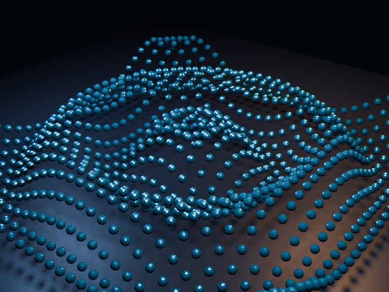

# Geometry Nodes Ripple Grid

Procedural radial wave field built with Geometry Nodes: Grid, Set Position, Mesh to Points, Icosphere instancing, and Realize Instances.

- source commit: `2b361ff6a650bd4e22acbea532e5a183ecf5b4f6`
- Actions run: `19` (`36222746274`)
- full artifact: `blender-geometry-nodes-ripple-grid`

## Blend files

- Git: [geometry-nodes.blend](./geometry-nodes.blend) (916,526 bytes)



## Validation

```json
{
  "render": {
    "path": "output/render.png",
    "size_bytes": 759589,
    "width": 768,
    "height": 576,
    "luminance_min": 2,
    "luminance_max": 230,
    "luminance_mean": 43.018,
    "luminance_stddev": 35.454,
    "unique_colors_64x48": 2388,
    "sha256": "0a5407789408af84194d9aeaa14215ad6d07dc1bd4cf2fddb32be4163ce36a22"
  },
  "geometry_nodes": {
    "node_group": "GN_RippleGrid",
    "node_count": 15,
    "grid_point_count": 961,
    "evaluated_vertices": 40362,
    "evaluated_edges": 115320,
    "evaluated_polygons": 76880,
    "blend_size_bytes": 916526
  }
}
```

## License / ライセンス

Unless otherwise noted, generated assets in this result (including rendered images, video, and generated .blend files) are CC0-1.0. Source code and workflow files used to generate them are MIT-0.

特記のない限り、この成果物内の生成アセット（レンダリング画像、動画、生成された .blend ファイル等）は CC0-1.0、生成に使用したソースコードや workflow は MIT-0 です。

Third-party data, assets, or source material remain subject to their original licenses and terms. These repository licenses apply only to rights we are entitled to grant.

第三者のデータ・アセット・素材・ソースを利用している部分は、利用元のライセンスおよび利用条件に従います。このリポジトリのライセンスは、こちらが許諾できる権利にのみ適用されます。

See ../../LICENSE and ../../LICENSES/ for details.
