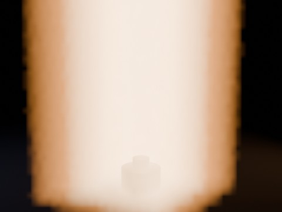

# Geometry Nodes Volume Flame v2

Second-pass low-cost pre-render of a procedural flame using two Geometry Nodes volume layers (outer and core) tuned to avoid the washed-out look of the first attempt.

- source commit: `b7426212de23b2afefd1533900259b39b2ba448c`
- Actions run: `30` (`36234002366`)
- full artifact: `blender-geometry-nodes-volume-flame-v2`

## Blend files

- Git: [geometry-nodes-volume-flame-v2.blend](./geometry-nodes-volume-flame-v2.blend) (1,160,080 bytes)



## Validation

```json
{
  "video": "volume-flame-v2.mp4",
  "preview": {
    "path": "output/preview.png",
    "width": 480,
    "height": 360,
    "luminance_min": 0,
    "luminance_max": 238,
    "luminance_mean": 148.766,
    "luminance_stddev": 92.147,
    "warm_ratio": 0.33324,
    "white_ratio": 0.03981,
    "sha256": "6865e819a666c4d2a6423d4f497665eeea96f6394d2c976ae0ea646941959487"
  },
  "movie": {
    "path": "output/volume-flame-v2.mp4",
    "width": 480,
    "height": 360,
    "duration_seconds": 4.0,
    "avg_frame_rate": "24/1",
    "nb_frames": "96",
    "sha256": "18e4a1f000e40def7bfbb3e98e62613082d456be3c65e75ce7118bc02b57b419"
  },
  "report": {
    "frame_start": 1,
    "frame_end": 96,
    "fps": 24,
    "resolution_x": 480,
    "resolution_y": 360,
    "requested_render_samples": 16,
    "effective_render_samples": 16,
    "seed_counts": [
      520,
      180
    ],
    "blend_size_bytes": 1160080,
    "materials": {
      "outer": {
        "name": "OuterFlameMaterial",
        "density": 0.2199999988079071,
        "emission_strength": 1.100000023841858,
        "blackbody_intensity": 0.2800000011920929,
        "temperature": 1425.0
      },
      "core": {
        "name": "CoreFlameMaterial",
        "density": 0.10000000149011612,
        "emission_strength": 1.5499999523162842,
        "blackbody_intensity": 0.46000000834465027,
        "temperature": 1980.0
      }
    }
  }
}
```

## License / ライセンス

Unless otherwise noted, generated assets in this result (including rendered images, video, and generated .blend files) are CC0-1.0. Source code and workflow files used to generate them are MIT-0.

特記のない限り、この成果物内の生成アセット（レンダリング画像、動画、生成された .blend ファイル等）は CC0-1.0、生成に使用したソースコードや workflow は MIT-0 です。

Third-party data, assets, or source material remain subject to their original licenses and terms. These repository licenses apply only to rights we are entitled to grant.

第三者のデータ・アセット・素材・ソースを利用している部分は、利用元のライセンスおよび利用条件に従います。このリポジトリのライセンスは、こちらが許諾できる権利にのみ適用されます。

See ../../LICENSE and ../../LICENSES/ for details.
