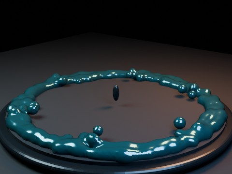

# Metaball Fountain 300 EEVEE

Three hundred animated metaball elements spray from a nozzle, bounce inside a basin, and merge into smooth mercury-like blobs.

- source commit: `cbd6614e238de4efe3e6c409eca7822b5574a814`
- Actions run: `42` (`36245916623`)
- full artifact: `blender-metaball-fountain-300-eevee`

## Blend files

- Git: [metaball-fountain-300-eevee.blend](./metaball-fountain-300-eevee.blend) (8,512,524 bytes)



## Validation

```json
{
  "video": "metaball-fountain-300-eevee.mp4",
  "preview": {
    "path": "output/preview.png",
    "size_bytes": 224190,
    "width": 480,
    "height": 360,
    "luminance_min": 0,
    "luminance_max": 232,
    "luminance_mean": 41.763,
    "luminance_stddev": 37.504,
    "sha256": "0522b0bcb51490cf4fee980bb8fb8c4b9392eecde65cb35894c975bc0f4c372d"
  },
  "movie": {
    "path": "output/metaball-fountain-300-eevee.mp4",
    "size_bytes": 218509,
    "width": 480,
    "height": 360,
    "duration_seconds": 6.0,
    "avg_frame_rate": "24/1",
    "nb_frames": "144",
    "sha256": "9a2da19b3fb3ec3d2acb0e2511fab8d3ef593dc7536fea5566206799d29c8eaf"
  },
  "report": {
    "engine": "BLENDER_EEVEE",
    "element_count": 300,
    "resolution": 0.11999999731779099,
    "render_resolution": 0.07500000298023224,
    "fcurve_count": 1200,
    "keyframe_points": 100402,
    "max_height": 2.820052,
    "total_bounces": 600,
    "active_at_preview": 300,
    "close_pairs_at_preview": 3859,
    "blend_size_bytes": 8512524
  }
}
```

## License / ライセンス

Unless otherwise noted, generated assets in this result (including rendered images, video, and generated .blend files) are CC0-1.0. Source code and workflow files used to generate them are MIT-0.

特記のない限り、この成果物内の生成アセット（レンダリング画像、動画、生成された .blend ファイル等）は CC0-1.0、生成に使用したソースコードや workflow は MIT-0 です。

Third-party data, assets, or source material remain subject to their original licenses and terms. These repository licenses apply only to rights we are entitled to grant.

第三者のデータ・アセット・素材・ソースを利用している部分は、利用元のライセンスおよび利用条件に従います。このリポジトリのライセンスは、こちらが許諾できる権利にのみ適用されます。

See ../../LICENSE and ../../LICENSES/ for details.
