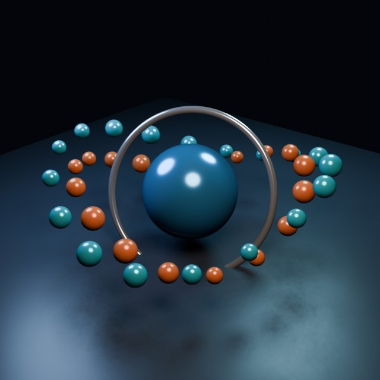

# Orbital Sculpture

Procedural metallic sphere, tilted torus, and two colored orbital rings.

- source commit: `eb0296e5a28f69e6b2d316f7671b66dbffc732e9`
- Actions run: `27` (`36230258277`)
- full artifact: `blender-orbital-sculpture`



## Validation

```json
{
  "path": "output/render.png",
  "size_bytes": 492820,
  "width": 640,
  "height": 640,
  "luminance_min": 0,
  "luminance_max": 249,
  "luminance_mean": 47.769,
  "luminance_stddev": 42.64,
  "unique_colors_64x64": 2274,
  "sha256": "e56ba4caf5fc96da4a6c3408f7bcfafde4cecbc5e07595408c48267c18610651"
}
```

## License / ライセンス

Unless otherwise noted, generated assets in this result (including rendered images, video, and generated .blend files) are CC0-1.0. Source code and workflow files used to generate them are MIT-0.

特記のない限り、この成果物内の生成アセット（レンダリング画像、動画、生成された .blend ファイル等）は CC0-1.0、生成に使用したソースコードや workflow は MIT-0 です。

Third-party data, assets, or source material remain subject to their original licenses and terms. These repository licenses apply only to rights we are entitled to grant.

第三者のデータ・アセット・素材・ソースを利用している部分は、利用元のライセンスおよび利用条件に従います。このリポジトリのライセンスは、こちらが許諾できる権利にのみ適用されます。

See ../../LICENSE and ../../LICENSES/ for details.
