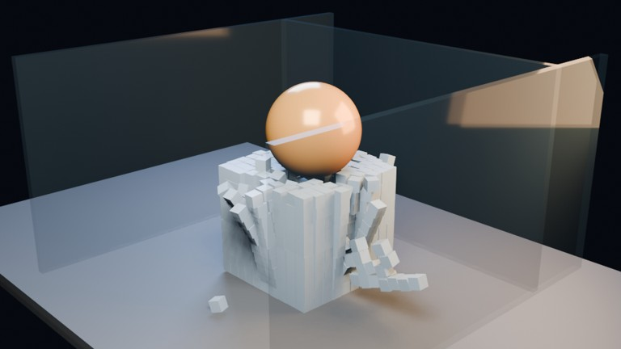

# Rigid Sphere Impact 1000 Transparent V2

A heavier, higher-quality 1000-body sphere impact experiment with transparent physical containment walls.

- source commit: `1662fa8e863ed9838e751be0ac8b9bb9f8d73bdd`
- Actions run: `18` (`36219589354`)
- full artifact: `blender-rigid-sphere-impact-1000-transparent-v2`

## Blend files

- Git: [rigid-sim.blend](./rigid-sim.blend) (9,613,412 bytes)
- Git: [rigid-result.blend](./rigid-result.blend) (9,613,412 bytes)



## Validation

```json
{
  "video": "rigid-sphere-impact-1000-transparent-v2.mp4",
  "video_size_bytes": 459528,
  "container": "mp4",
  "width": 960,
  "height": 540,
  "duration_seconds": 4.0,
  "fps": 24,
  "poster": "poster.png",
  "poster_frame": 44,
  "rigid_body_cubes": 1000,
  "impact_spheres": 1,
  "transparent_walls": 3,
  "rigid_substeps_per_frame": 12,
  "rigid_solver_iterations": 30,
  "poster_luminance_min": 8,
  "poster_luminance_max": 241,
  "poster_luminance_stddev": 65.199,
  "bright_pixel_ratio": 0.271584,
  "warm_pixel_ratio": 0.067315,
  "cool_pixel_ratio": 0.243135,
  "rigid_sim_blend_bytes": 9613412,
  "rigid_result_blend_bytes": 9613412,
  "sha256": "35d4910ad7ad74db4e5f3290c48f9a68d607daea78d5d20196e6f307c909e0f6"
}
```

## License / ライセンス

Unless otherwise noted, generated assets in this result (including rendered images, video, and generated .blend files) are CC0-1.0. Source code and workflow files used to generate them are MIT-0.

特記のない限り、この成果物内の生成アセット（レンダリング画像、動画、生成された .blend ファイル等）は CC0-1.0、生成に使用したソースコードや workflow は MIT-0 です。

Third-party data, assets, or source material remain subject to their original licenses and terms. These repository licenses apply only to rights we are entitled to grant.

第三者のデータ・アセット・素材・ソースを利用している部分は、利用元のライセンスおよび利用条件に従います。このリポジトリのライセンスは、こちらが許諾できる権利にのみ適用されます。

See ../../LICENSE and ../../LICENSES/ for details.
