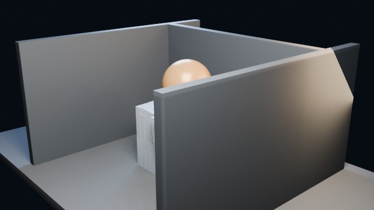

# Rigid Sphere Impact 1000

A heavy sphere drops from above and blasts through a stack of 1000 rigid body cubes.

- source commit: `377b43b1aab3c7ed5dcee8b34a69d333df7b7894`
- Actions run: `17` (`36218506754`)
- full artifact: `blender-rigid-sphere-impact-1000`

## Blend files

- Git: [rigid-sim.blend](./rigid-sim.blend) (8,844,900 bytes)
- Git: [rigid-result.blend](./rigid-result.blend) (8,844,900 bytes)



## Validation

```json
{
  "video": "rigid-sphere-impact-1000.mp4",
  "video_size_bytes": 90435,
  "container": "mp4",
  "width": 640,
  "height": 360,
  "duration_seconds": 3.0,
  "fps": 24,
  "poster": "poster.png",
  "poster_frame": 36,
  "rigid_body_cubes": 1000,
  "impact_spheres": 1,
  "poster_luminance_min": 11,
  "poster_luminance_max": 238,
  "poster_luminance_stddev": 52.367,
  "bright_pixel_ratio": 0.061033,
  "warm_pixel_ratio": 0.014175,
  "cool_pixel_ratio": 0.110755,
  "rigid_sim_blend_bytes": 8844900,
  "rigid_result_blend_bytes": 8844900,
  "sha256": "7a8463d0829c5d087a831fde3d1e16509eccb7797851834949fbfc2c17f8ce88"
}
```

## License / ライセンス

Unless otherwise noted, generated assets in this result (including rendered images, video, and generated .blend files) are CC0-1.0. Source code and workflow files used to generate them are MIT-0.

特記のない限り、この成果物内の生成アセット（レンダリング画像、動画、生成された .blend ファイル等）は CC0-1.0、生成に使用したソースコードや workflow は MIT-0 です。

Third-party data, assets, or source material remain subject to their original licenses and terms. These repository licenses apply only to rights we are entitled to grant.

第三者のデータ・アセット・素材・ソースを利用している部分は、利用元のライセンスおよび利用条件に従います。このリポジトリのライセンスは、こちらが許諾できる権利にのみ適用されます。

See ../../LICENSE and ../../LICENSES/ for details.
