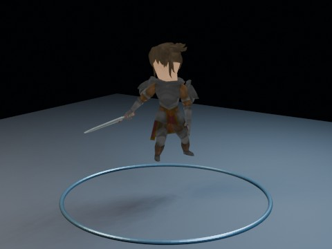

# Quaternius RPG Character Motion Showreel Long EEVEE

Long-form character animation stress test: schedules all 13 imported Quaternius Warrior actions for six seconds each, producing a 78-second EEVEE movie through the parallel GitHub Actions frame pipeline.

- source commit: `b04a3984b061b70b9f9cde3797cd062d6b78f4b7`
- Actions run: `52` (`36280865475`)
- full artifact: `blender-rpg-character-motion-showreel-long-eevee`

## Blend files

- Git: [rpg-character-motion-showreel-long-eevee.blend](./rpg-character-motion-showreel-long-eevee.blend) (13,663,428 bytes)



## Validation

```json
{
  "video": "rpg-character-motion-showreel-long-eevee.mp4",
  "preview": {
    "size_bytes": 193749,
    "luminance_min": 1,
    "luminance_max": 222,
    "luminance_stddev": 52.556,
    "sha256": "f10dbad4500e24e48505cd8b9108c33330ddc6162d001e6bff039c1d927ad70b"
  },
  "movie": {
    "size_bytes": 334566,
    "duration_seconds": 78.0,
    "avg_frame_rate": "24/1",
    "nb_frames": "1872",
    "sha256": "0634e93611b96fddd967929407e8e197bfdc349e928c79abd7c2fae93c3ef565"
  },
  "report": {
    "asset_file": "Warrior.glb",
    "mesh_count": 6,
    "armature_count": 1,
    "action_count": 13,
    "scheduled_action_count": 13,
    "scheduled_action_names": [
      "Idle_Attacking_CharacterArmature",
      "Idle_CharacterArmature",
      "Idle_Weapon_CharacterArmature",
      "Walk_CharacterArmature",
      "Run_CharacterArmature",
      "Run_Weapon_CharacterArmature",
      "Sword_Attack2_CharacterArmature",
      "Sword_Attack_CharacterArmature",
      "RecieveHit_CharacterArmature",
      "Death_CharacterArmature",
      "PickUp_CharacterArmature",
      "Punch_CharacterArmature",
      "Roll_CharacterArmature"
    ],
    "material_count": 2,
    "image_count": 3,
    "preview_height": 2.63047,
    "blend_size_bytes": 13663428
  }
}
```

## License / ライセンス

Unless otherwise noted, generated assets in this result (including rendered images, video, and generated .blend files) are CC0-1.0. Source code and workflow files used to generate them are MIT-0.

特記のない限り、この成果物内の生成アセット（レンダリング画像、動画、生成された .blend ファイル等）は CC0-1.0、生成に使用したソースコードや workflow は MIT-0 です。

Third-party data, assets, or source material remain subject to their original licenses and terms. These repository licenses apply only to rights we are entitled to grant.

第三者のデータ・アセット・素材・ソースを利用している部分は、利用元のライセンスおよび利用条件に従います。このリポジトリのライセンスは、こちらが許諾できる権利にのみ適用されます。

See ../../LICENSE and ../../LICENSES/ for details.
