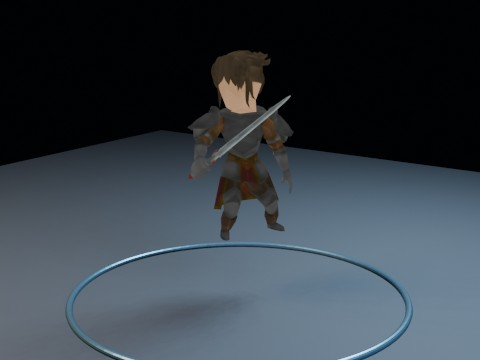

# Quaternius RPG Character Smoke Test EEVEE

Downloads the official CC0 Quaternius RPG Character Pack during Actions, imports one rigged fantasy character, plays an existing animation, packs dependencies into a prepared Blend, and renders a six-second EEVEE smoke-test movie.

- source commit: `2caaa9dc1f10c34953b96148d834d49368a25450`
- Actions run: `50` (`36277861293`)
- full artifact: `blender-rpg-character-pack-smoke-test-eevee`

## Blend files

- Git: [rpg-character-pack-smoke-test-eevee.blend](./rpg-character-pack-smoke-test-eevee.blend) (13,727,672 bytes)



## Validation

```json
{
  "video": "rpg-character-pack-smoke-test-eevee.mp4",
  "preview": {
    "size_bytes": 195395,
    "luminance_min": 1,
    "luminance_max": 224,
    "luminance_mean": 60.827,
    "luminance_stddev": 51.293,
    "sha256": "0c487cc311ad6b3db2866c3d644071dd4b2966eca21806267c0e198635ca38c2"
  },
  "movie": {
    "size_bytes": 21620,
    "duration_seconds": 6.0,
    "avg_frame_rate": "24/1",
    "nb_frames": "144",
    "sha256": "c81b6f31dc9e0f042d613cd4254eece335282d6bdc5774949d0f3a016f07865d"
  },
  "report": {
    "asset_file": "Warrior.glb",
    "asset_format": ".glb",
    "mesh_count": 6,
    "armature_count": 1,
    "action_count": 13,
    "selected_action": "Idle_Attacking_CharacterArmature",
    "material_count": 2,
    "image_count": 3,
    "preview_height": 2.63047,
    "blend_size_bytes": 13727672
  }
}
```

## License / ライセンス

Unless otherwise noted, generated assets in this result (including rendered images, video, and generated .blend files) are CC0-1.0. Source code and workflow files used to generate them are MIT-0.

特記のない限り、この成果物内の生成アセット（レンダリング画像、動画、生成された .blend ファイル等）は CC0-1.0、生成に使用したソースコードや workflow は MIT-0 です。

Third-party data, assets, or source material remain subject to their original licenses and terms. These repository licenses apply only to rights we are entitled to grant.

第三者のデータ・アセット・素材・ソースを利用している部分は、利用元のライセンスおよび利用条件に従います。このリポジトリのライセンスは、こちらが許諾できる権利にのみ適用されます。

See ../../LICENSE and ../../LICENSES/ for details.
