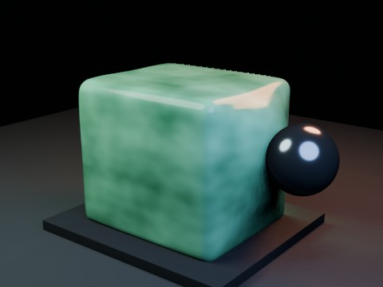

# Soft Body Jelly Cube Impact EEVEE

A rounded translucent jelly cube is struck by a fast animated metal sphere. Blender Soft Body deformation is sampled sequentially into shape keys before parallel EEVEE frame rendering.

- source commit: `4d19e8a3e65ff6009293851cd6bf5672cfec7deb`
- Actions run: `40` (`36243606380`)
- full artifact: `blender-softbody-jelly-cube-impact-eevee`

## Blend files

- Git: [softbody-jelly-cube-impact-eevee.blend](./softbody-jelly-cube-impact-eevee.blend) (2,754,848 bytes)



## Validation

```json
{
  "video": "softbody-jelly-cube-impact-eevee.mp4",
  "preview": {
    "path": "output/preview.png",
    "size_bytes": 201026,
    "width": 480,
    "height": 360,
    "luminance_min": 0,
    "luminance_max": 223,
    "luminance_mean": 58.164,
    "luminance_stddev": 56.238,
    "sha256": "9bf39ba92054b53582ea54c25412ba772034f6dfa5c9c7f1b9d2555b761909bc"
  },
  "movie": {
    "path": "output/softbody-jelly-cube-impact-eevee.mp4",
    "size_bytes": 31373,
    "width": 480,
    "height": 360,
    "duration_seconds": 6.0,
    "avg_frame_rate": "24/1",
    "nb_frames": "144",
    "sha256": "5ee5af18d76dfd0b4d6a7ba0bb5b1bdb098d39c72777541e46813f2f47d5394d"
  },
  "report": {
    "engine": "BLENDER_EEVEE",
    "vertex_count": 866,
    "face_count": 864,
    "baked_shape_keys": 144,
    "shape_key_count": 145,
    "simulation_seconds": 1.283,
    "max_displacement": 0.8083,
    "max_displacement_frame": 61,
    "projectile_keyframes": 8,
    "blend_size_bytes": 2754848
  }
}
```

## License / ライセンス

Unless otherwise noted, generated assets in this result (including rendered images, video, and generated .blend files) are CC0-1.0. Source code and workflow files used to generate them are MIT-0.

特記のない限り、この成果物内の生成アセット（レンダリング画像、動画、生成された .blend ファイル等）は CC0-1.0、生成に使用したソースコードや workflow は MIT-0 です。

Third-party data, assets, or source material remain subject to their original licenses and terms. These repository licenses apply only to rights we are entitled to grant.

第三者のデータ・アセット・素材・ソースを利用している部分は、利用元のライセンスおよび利用条件に従います。このリポジトリのライセンスは、こちらが許諾できる権利にのみ適用されます。

See ../../LICENSE and ../../LICENSES/ for details.
