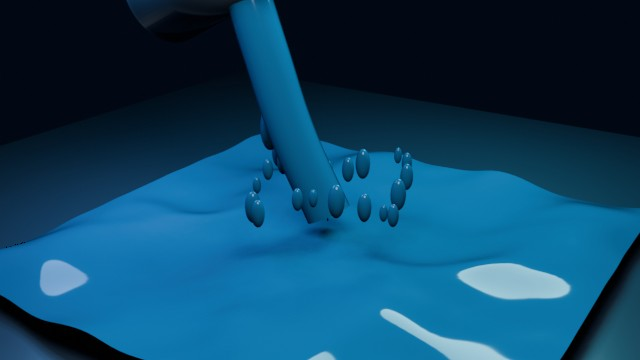

# Water Dump

A short water-like pour animation using an animated Ocean surface, a continuous stream, falling droplets, and a splash ring.

- source commit: `5c9e0e14f0c596f3f247b07cc1d58a209ad7b590`
- Actions run: `8` (`36213194885`)
- full artifact: `blender-water-dump`



## Validation

```json
{
  "video": "water-dump.mp4",
  "video_size_bytes": 128655,
  "container": "mp4",
  "width": 640,
  "height": 360,
  "duration_seconds": 3.0,
  "fps": 24,
  "poster": "poster.png",
  "poster_luminance_min": 0,
  "poster_luminance_max": 194,
  "poster_luminance_stddev": 42.403,
  "poster_unique_colors_64x36": 1241,
  "sha256": "1b0a460dfabce6b75d0440dbc0853c76aa1b39db5b127cb9cd5c4c91cb081174"
}
```

## License / ライセンス

Unless otherwise noted, generated assets in this result (including rendered images, video, and generated .blend files) are CC0-1.0. Source code and workflow files used to generate them are MIT-0.

特記のない限り、この成果物内の生成アセット（レンダリング画像、動画、生成された .blend ファイル等）は CC0-1.0、生成に使用したソースコードや workflow は MIT-0 です。

Third-party data, assets, or source material remain subject to their original licenses and terms. These repository licenses apply only to rights we are entitled to grant.

第三者のデータ・アセット・素材・ソースを利用している部分は、利用元のライセンスおよび利用条件に従います。このリポジトリのライセンスは、こちらが許諾できる権利にのみ適用されます。

See ../../LICENSE and ../../LICENSES/.
